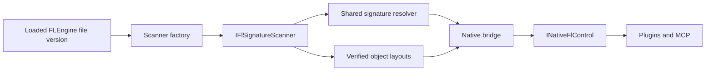

# Version-specific scanner composition

The native bridge selects an `IFlSignatureScanner` once from the loaded engine's four-part file
version. `Fl2025SignatureScanner`, `Fl2026SignatureScanner`, and `UnsupportedSignatureScanner` own
version policy. The plugin host and MCP continue to consume `INativeFlControl`; neither selects
scanners nor calculates version-dependent addresses.

This is native dependency injection: `resolveSymbols` receives the scanner through its interface.
Both live composition and file inspection use the same factory and orchestration. Tests inject an
independent implementation. A managed DI container would duplicate version selection on the wrong
side of the process-memory boundary.

## Separate kinds of evidence

- **Supported family:** FL 25 and FL 26 may use the shared, independently matched symbol recipes.
  FL 24, future major versions, and missing version metadata select the unsupported implementation.
- **Verified address:** an exact recorded build may use its checked fallback addresses. A newer
  patch cannot inherit an older patch's addresses. A signature disagreeing with a recorded address
  is refused, even if it matched only once.
- **Verified layout:** raw object fields have a separate exact-build profile. Locating a function
  does not validate the structures it operates on. Mixer, menu-discovery, legacy browser, and window layouts are independent
  capabilities; recovering the host class reference does not enable unverified window embedding.

The scanning algorithm, uniqueness checks, RIP-relative decoding, and legacy address mapping are
shared. Family implementations contain policy and layout data instead of copied pattern scanners.
The engine image size and executable ranges are collected once per resolution batch. The completed
scanner and symbol table are published together; callers cannot observe a partly initialized table.

## Diagnostics and managed use

`syms` retains `ver`, `ok`, `fail`, and `unresolved` for existing consumers, and adds:

| Field | Meaning |
| --- | --- |
| `fileVersion` | Actual four-part engine file version |
| `scanner` | `fl-2025`, `fl-2026`, or `unsupported` |
| `supported` | The family has a scanner; this does not promise all features |
| `complete` | Resolution finished, including an unsupported or entirely failed scan |
| `mixerTrackStride` | Optional compatibility diagnostic; insufficient to authorize mixer writes |
| `mixerLayout` | Complete verified mixer field layout, or `null` |
| `timelineLayout` | Verified timeline marker manager and record layout, or `null`; required for marker and loop operations |
| `windowEmbedding` | Whether an exact window layout is available |
| `pluginMenu` | Whether menu-discovery field offsets are verified |
| `legacyBrowserUi` | Whether legacy browser widgets have a verified layout |

Before the engine is loaded, `complete:false` is returned. Managed clients retry pending results,
but honor completed failures even when zero symbols resolved. Stable in-process results are cached;
development pipe clients query again because reconnecting can reach a different engine process.

The managed mixer implementation reads `FlSymbolStatus.MixerLayout`. It does not branch on the
legacy `ver` index or infer a layout from the scalar stride. Missing layouts stop the operation
before mutation. This intentionally requires an updated native bridge alongside the updated managed
SDK for raw mixer operations; older bridge diagnostics do not prove the full layout.

## Adding a build

1. Inspect its engine file without executing it, recording the file version and SHA-256.
2. Confirm unique pattern matches and semantic identity in Ghidra. Retain symbol names and the
   existing 2025 wire-address aliases.
3. Validate every changed raw field and calling convention used by the intended capability.
4. Add exact-build layout data to the appropriate family implementation, with evidence and tests.
   Do not expand an address fallback or layout check to an entire major version.
5. Run native scanner tests, installed-file inspection, and the managed quality gate.
6. Exercise disposable FL projects for editing, save/reopen, plugin lifecycle, and rendering before
   distributing a compatibility claim.

See [the binary analysis](fl-version-analysis-2026-09-12.md) for the installed build evidence and
[the native bridge](native-bridge.md) for build commands and the current compatibility matrix.

The inspected 2026 build supports plugin-menu discovery while legacy browser widgets remain
unavailable: Ghidra found moved QuickEdit text/caret/flag fields. Browser creation is stopped
before creating controls or installing callbacks. The menu-discovery fields are separately
verified on both installed builds, so this gate does not disable the current plugin menu.
